```{r setup, include=FALSE}
knitr::opts_chunk$set(echo = TRUE)
```

# Streszczenie

- summary
- wnioski 
- mamy wyjaśnić czego dotyczy praca

# Wstęp


Nasz projekt dotyczy tematu skoringu kredytowego. 
Głównym zadaniem była ocena zdolności kredytowej klientów banku. Dane, które otrzymaliśmy zawierały następujące cechy :

RiskPerformance <- target 

ExternalRiskEstimate

MSinceOldestTradeOpen

MSinceMostRecentTradeOpen

AverageMInFile

NumSatisfactoryTrades

NumTrades60Ever2DerogPubRec

NumTrades90Ever2DerogPubRec

PercentTradesNeverDelq

MSinceMostRecentDelq

MaxDelq2PublicRecLast12M

MaxDelqEver

NumTotalTrades

NumTradesOpeninLast12M

PercentInstallTrades

MSinceMostRecentInqexcl7days

NumInqLast6M

NumInqLast6Mexcl7days

NetFractionRevolvingBurden

NetFractionInstallBurden

NumRevolvingTradesWBalance

NumInstallTradesWBalance

NumBank2NatlTradesWHighUtilization

PercentTradesWBalance


# Cel

Celem projektu było przygotowanie użytecznego modelu 
predykcji zdolności kredytowej klienta. W tej pracy 
udowodnimy zasadność zbudowanego przez nas modelu.

# Analiza zbioru danych

---

W tej części znajduje się przeprowadzona przez nas analiza dostępnego 
zbioru danych. Zinterpretowaliśmy cechy rekordów, ich znaczenie, a także
rozmaite flagi wykorzystane przez autorów, do oznaczania braków, nieścisłości etc. 

***

## Pochodzenie danych

Dane na których operujemy, zostały udostępnione w ramach
konkursu https://community.fico.com/s/explainable-machine-learning-challenge przez firmę FICO.

***

## Flagi

---

W danych pojawiają się następujące flagi:

* -9 - brak zapisu biurowego lub brak prześledzenia

* -8 - brak użytecznych/ważnych kredytów lub recenzji kredytu

* -7 - warunek niespełniony

`-9` oznacza zwykły brak danych, brak zapisu o czymś. 
Zwykle kiedy w rekordzie pojawiała się flaga `-9`, pojawiała
się we wszystkich kolumnach rekordu. Takich rekordów było 558 na 10 459 wszystkich rekordów datasetu. Te rekordy _usunęliśmy_.

`-8` oznacza brak danych użytecznych. W odróżnieniu od `-9` ta flaga nie
pojawiała się w całym rekordzie. Ponieważ liczba rekordów zawierających 
tę flagę była bardzo duża, braki te imputowaliśmy (patrz roz. N).

Flaga `-7` pojawiała się wtedy, gdy dla danego kredytobiorcy danych 
nie da się logicznie uzupełnić, np. jeżeli dana kolumna podaje czas od 
ostatniego spóźnienia w spłacaniu kredytu, podczas gdy kredytobiorca nie 
spóźnił się ani razu. Z oczywistych względów mierzenie czasu, który
upłynął od zdarzenia, które nie zaszło, jest nielogiczne.

***

## Flagi - krótkie zestawienie

Oto jak przedstawia się udział poszczególnych flag w różnych kolumnach:

| Nazwa kolumny | *-9* | *-8* | *-7* |
|---|---|---|---|
| ExternalRiskEstimate               | 10 | 0  | 0  |
| MSinceOldestTradeOpen              | 0  | 239| 0  |
| MSinceMostRecentDelq               | 0  | 176|4664|
| MSinceMostRecentInqexcl7days       | 0  | 476|1855|
| NetFractionRevolvingBurden         | 0  | 186| 0  |
| NetFractionInstallBurden           | 0  |3419| 0  |
| NumRevolvingTradesWBalance         | 0  | 156| 0  |
| NumInstallTradesWBalance           | 0  | 861| 0  |
| NumBank2NatlTradesWHighUtilization | 0  | 583| 0  |
| PercentTradesWBalance              | 0  | 18 | 0  |

Jak widać przeciętnie dane występują w małej liczności w stosunku do 
wielkości zbioru danych (10 459), jednak kilka kolumn zawiera flag bardzo dużo. W sumie wierszy bez flag `-9`, `-8` i `-7` jest 2502, czyli zaledwie $\frac{1}{4}$ zbioru.

## Interpretacja i analiza cech

### Risk Performance

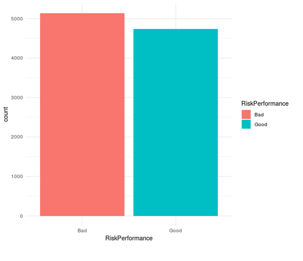

Zbiór wartości: {Good, Bad}

* -9 : 0

* -8 : 0

* -7 : 0

Czy zapłacono w terminie umowy? (12-36 miesięcy) 

Watrość przez nas przewidywana. Odpowiada na pytanie, czy klient spłacił 
kredyt w wyznaczonym terminie. Jest to wartość przez nas przewidywana. Jak 
widać liczności klas są podobne. 

### External Risk Estimate

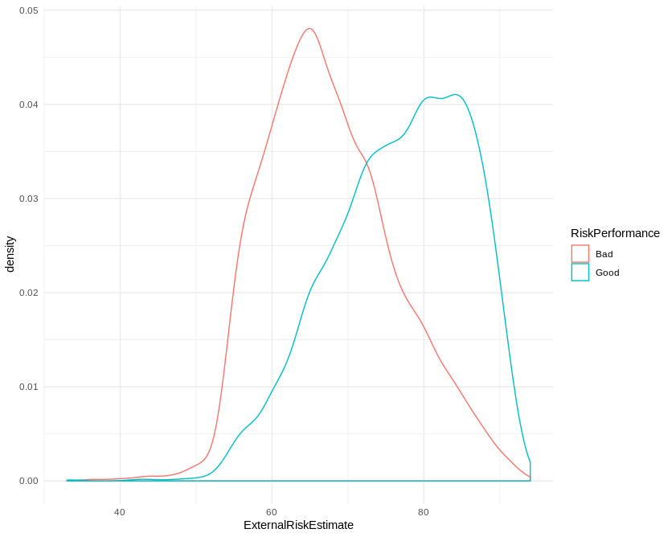

Zbiór wartości: 0-100%

* -9 : 0

* -8 : 239

* -7 : 0

Zewnętrzna ocena kredytobiorcy. Złożenie wielu nieznananych znaczników,
działających na korzyść bądź niekorzyść kredytobiorcy. Jak widać rozkłady 
grupy, która spłaciła na czas i grupy która nie spłaciła różnią się w przewidywalny
sposób. Potencjalnie bardzo ważna zmienna. 

### Months Since Oldest Trade Open

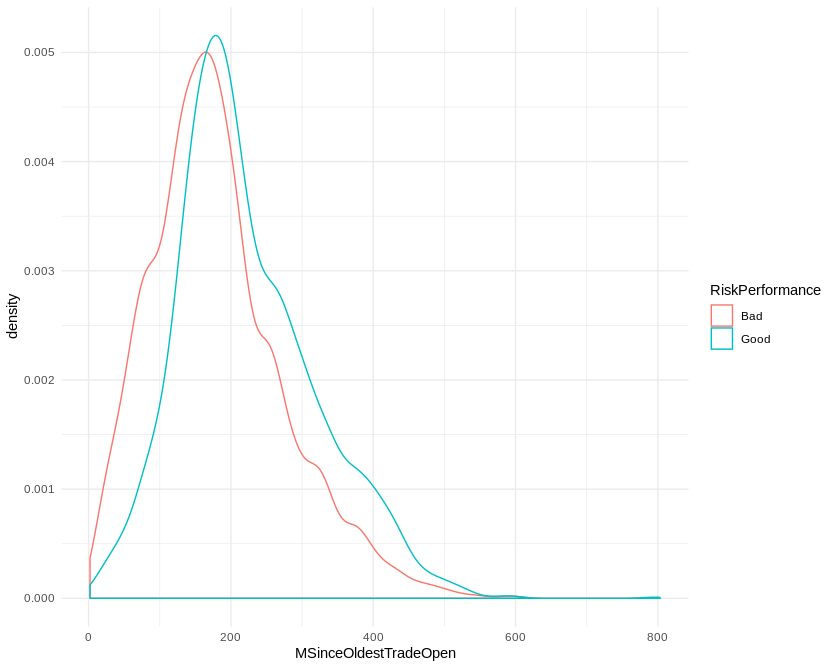

Zbiór wartości: 0-100%

* -9 : 0

* -8 : 239

* -7 : 0

Liczba miesięcy od otwarcia najstarszego kredytu.
Rozkłady podobne, jednak różne. Wskazują, że starzy klienci
częściej spłacają w czasie. (Tutaj uproszczenie, zakładamy że jeżeli
pierwszy kredyt otwarty został dawno, to klient jest stary).

### Months Since Most Recent Trade Open 

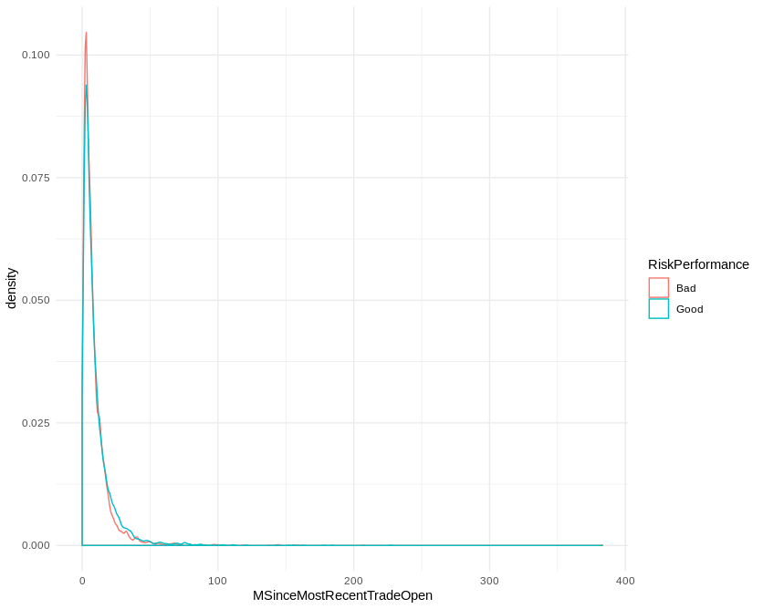

Zbiór wartości: 0, 1, 2, 3…

* -9 : 0  

* -8 : 0  

* -7 : 0

Liczba miesięcy od otwarcia ostatniego kredytu.
Praktycznie identyczne rozkłady. Tutaj można zastowosać 
przekształcenie logarytmiczne. 

### Average Months in File

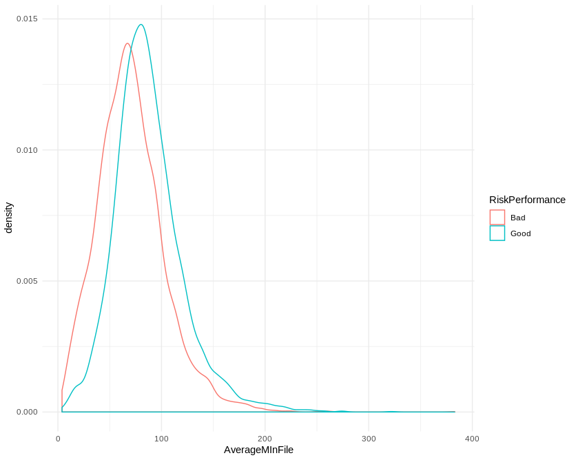

Zbiór wartości: 0, 1, 2, 3…

* -9 : 0

* -8 : 0

* -7 : 0

Średni czas spłaty kredytu w umowie. Różne rozkłady 
wskazują, że klienci, który biorą kredyty na dłuższy okres, częściej je spłacają.


### Number Satisfactory Trades

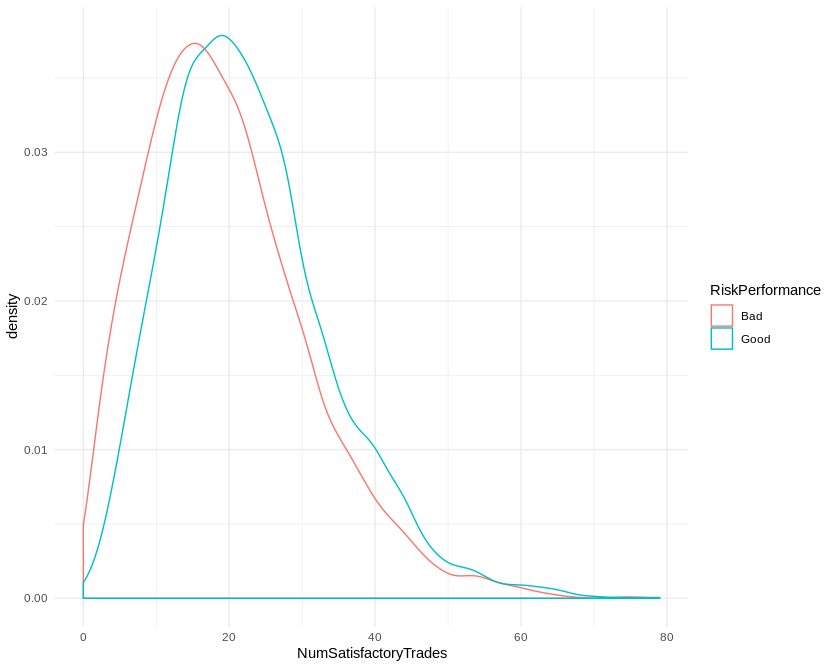

Zbiór wartości: $\mathcal{R}_+$

* -9 : 0

* -8 : 0

* -7 : 0

Liczba spłaconych kredytów w przeszłości. Jak widać ci, którzy częściej 
spłacali kredyty w przeszłości mają większe prawdopodobieństwo spłacenia ponownie. 

### Number Trades 60+ Ever

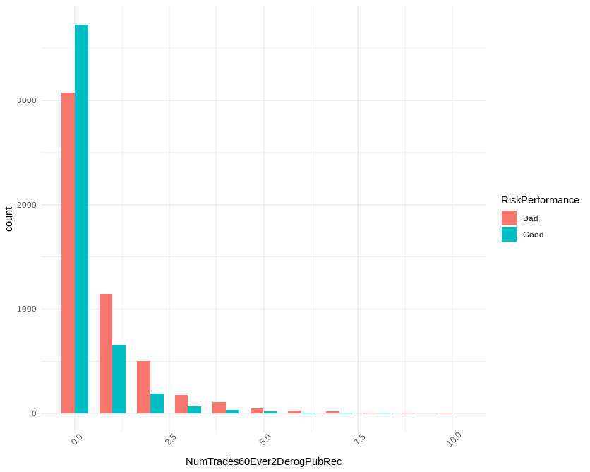

Zbiór wartości: $\mathcal{R}_+$

* -9 : 0

* -8 : 0

* -7 : 0

Liczba kredytów ponad 60 tys. Zmienna dyskretna.

### Number Trades 90+ Ever

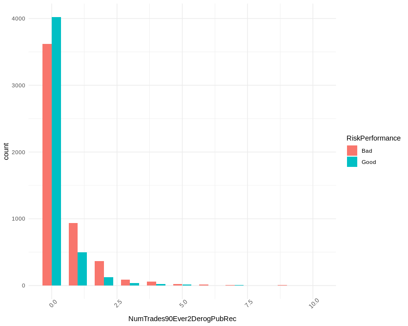

Zbiór wartości: 0, 1, 2, 3…

* -9 : 0

* -8 : 0

* -7 : 0

Liczba kredytów ponad 90 tys. Zmienna dyskretna. 
Podobnie jak poprzednia wskazuje, że Ci, którzy
biorą większe kredyty, rzadziej je spłacają. 

### Percent Trades Never Delinquent  

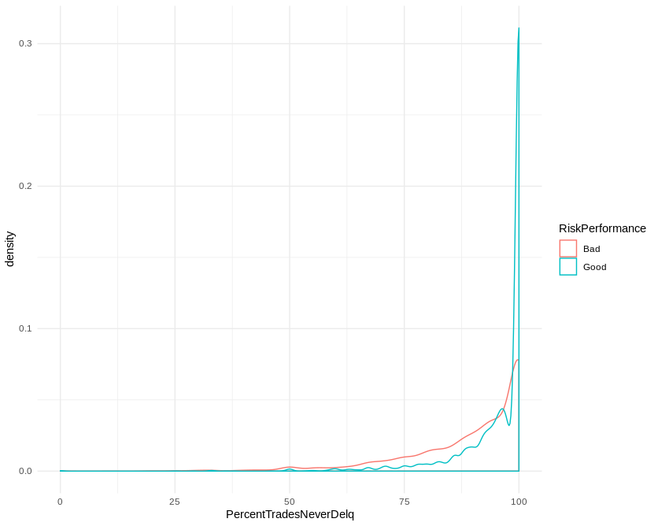

Zbiór wartości: 0-100%

* -9 : 0

* -8 : 0

* -7 : 0

Procent kredytów nigdy niezaległych. Jak widać
jest bardzo duża liczba klientów, którzy nigdy się nie spóźniają i 
zawsze spłacają kredyt. Fakt posiadania zaległych kredytów w przeszłości
zwiększa prawdopodobieństwo opóźnienia w spłacie kredytu. 

### Months Since Most Recent Delinquency      

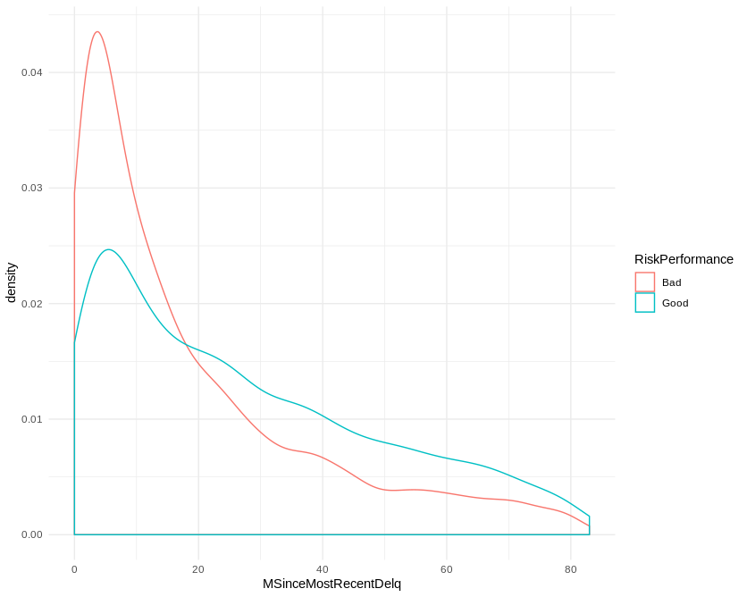

Zbiór wartości: 0, 1, 2, 3…

* -9 : 0

* -8 : 176

* -7 : 4664

Liczba miesięcy od ostatniego opóźnienia.
Jak widać ci, którzy nie spłacili na czas, częściej
niedawno się późnili. 


### Max Delq/Public Records Last 12 Months

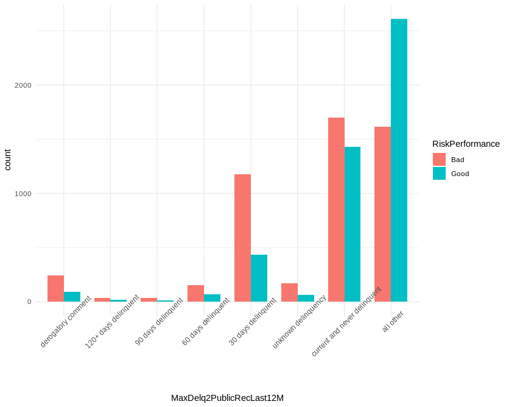

Values: {derogatory comment, 
	       120+ days delinquent,
	       90 days delinquent,
	       60 days delinquent,
	       30 days delinquent,
	       unknown delinquency,
	       current and never delinquent,
	       all other}

* -9 : 0 

* -8 : 0

* -7 : 0

Zmienna kategoryczna. Ci, którzy się spóźnili w spłacie kredytu,
mają częściej spóźnienia w przeszłości w szczególności ok 30 dni. 

### Maximum Delinquency Ever                       

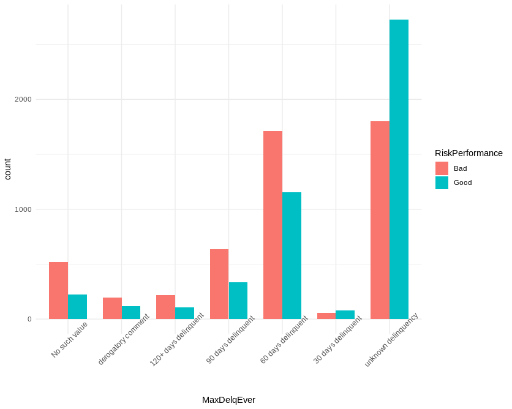

Values:    {No such value,
	       derogatory comment, 
	       120+ days delinquent,
	       90 days delinquent,
	       60 days delinquent,
	       30 days delinquent,
	       unknown delinquency,
	       current and never delinquent,
	       all other}
         
* -9 : 0 

* -8 : 0

* -7 : 0

Zmienna kategoryczna. Ponownie ci, którzy się spóźnili w spłacie kredytu,
mają częściej spóźnienia w przeszłości.

### Number Total Trades          

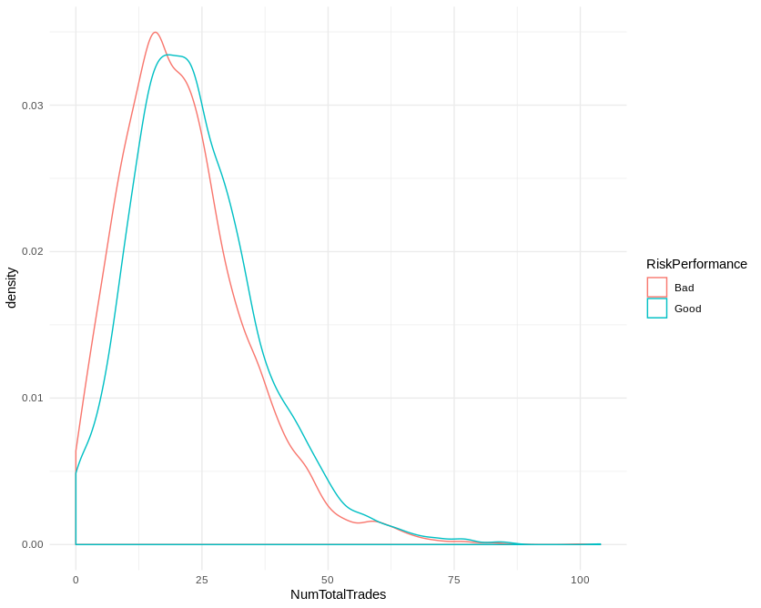

Zbiór wartości: 0, 1, 2, 3…

* -9 : 0

* -8 : 0

* -7 : 0

Całkowita liczba kredytów lub inaczej liczba kont kredytowych.
Bardzo podobne rozkłady.

### Number Trades Open in Last 12 Months     

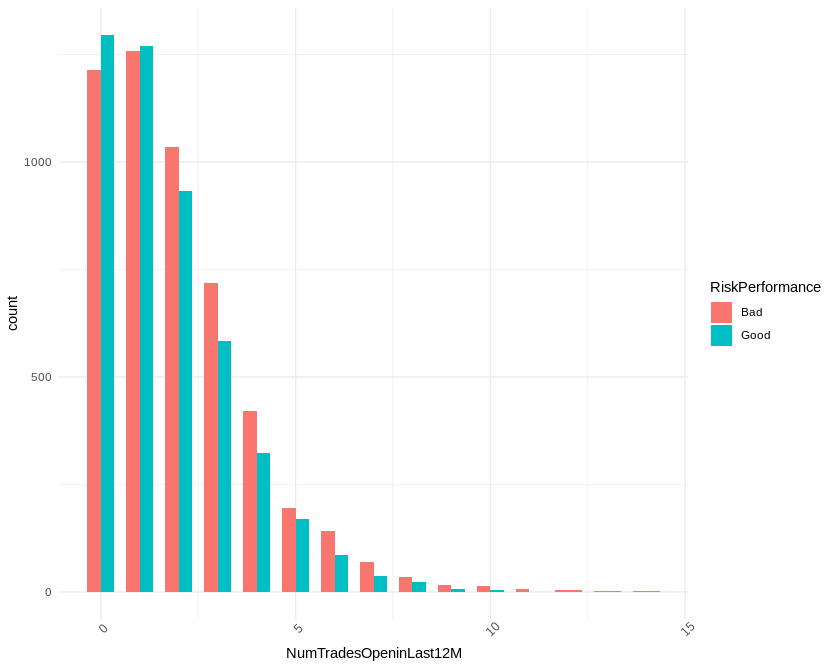

Zbiór wartości: 0, 1, 2, 3…

* -9 : 0

* -8 : 0

* -7 : 0

Liczba kredytów zaciągniętych podczas ostatnich dwunastu miesięcy.
Bardzo podobne rozkłady.

### Percent Installment Trades    

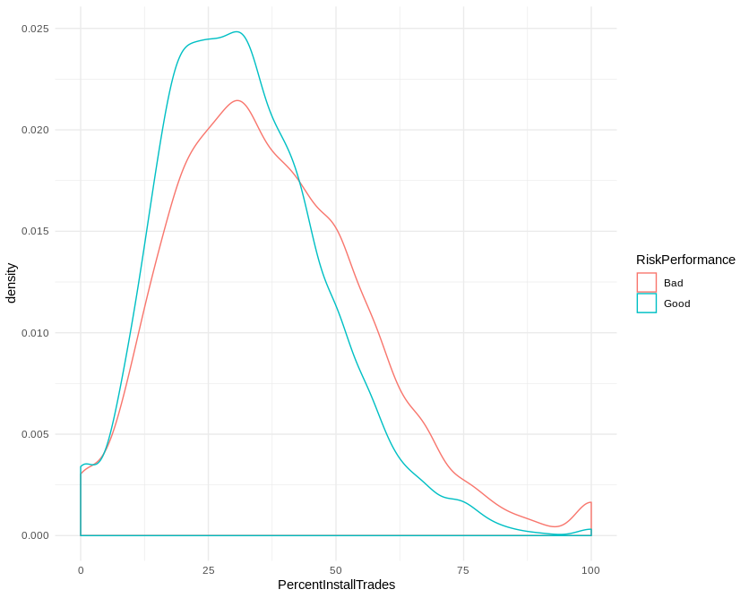

Zbiór wartości: 0-100%

* -9 : 0

* -8 : 0

* -7 : 0

Odsetek kredytów, które były ratalne tj. spłacane w ratach. 
Spłacane z opóźnieniem kredyty są częściej ratalne. 

### Months Since Most Recent Inq. Excl. 7 days      

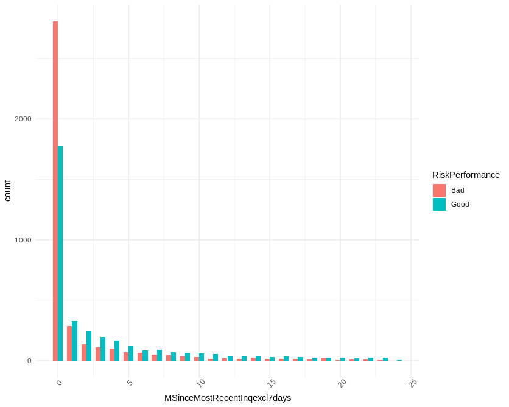

Zbiór wartości: 0, 1, 2, 3…

* -9 : 0

* -8 : 476

* -7 : 1855

Liczba miesięcy od ostatniego sprawdzenia kredytu (przekraczające 7 dni).
Jak widać ci, dla których przewiduje się opóźnienie są częściej sprawdzani. 

### Number Inq. Last 6 Months      


Zbiór wartości: 0, 1, 2, 3…

* -9 : 0

* -8 : 0

* -7 : 0

Liczba sprawdzeń kredytu podczas ostatnich 6 miesięcy.

### Number Inq. Last 6 Months excl. 7 days  

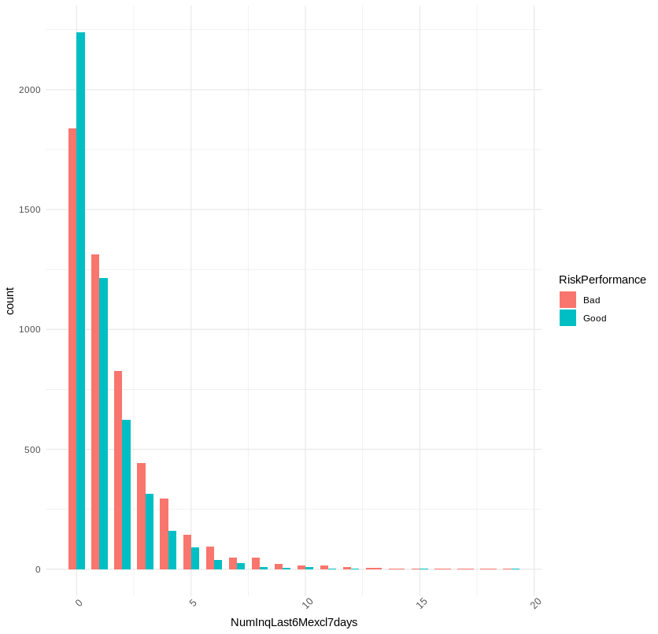

Zbiór wartości: 0, 1, 2, 3…

* -9 : 0

* -8 : 0

* -7 : 0

Liczba sprawdzeń kredtu przekaraczających 7 dni, podczas ostatnich 6 miesięcy. 

### Net Fraction Revolving Burden

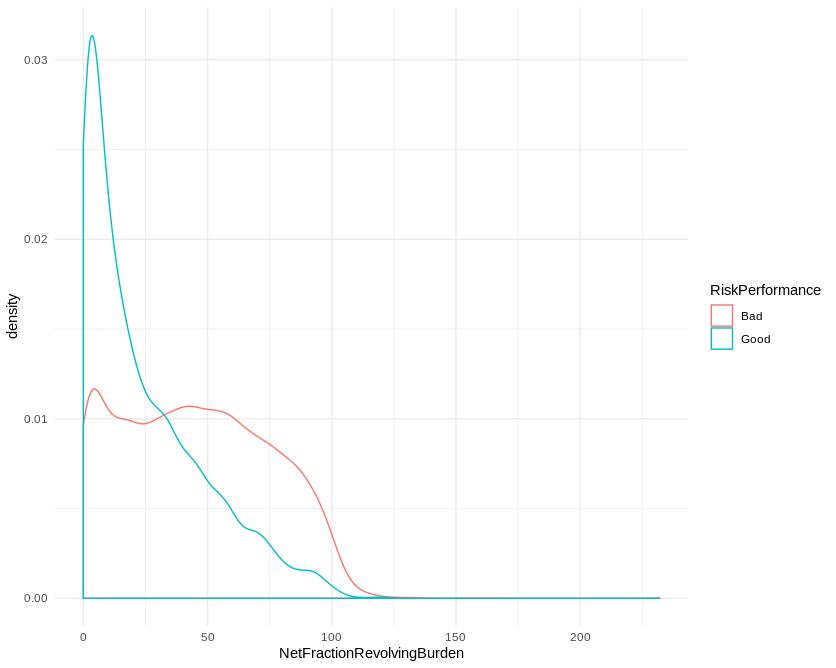

Zbiór wartości: 0, 1, 2, 3…

* -9 : 0

* -8 : 186

* -7 : 0

Udział kredytów rolowanych w obciążeniu kredytowym. 
Potencjalnie ważna zmienna, bardzo duża różnica rozkładów.
Ci którzy nie mogą spłacić kredytu zdecydowanie częściej rolują kredyty (przedłużają).

### Net Fraction Installment Burden

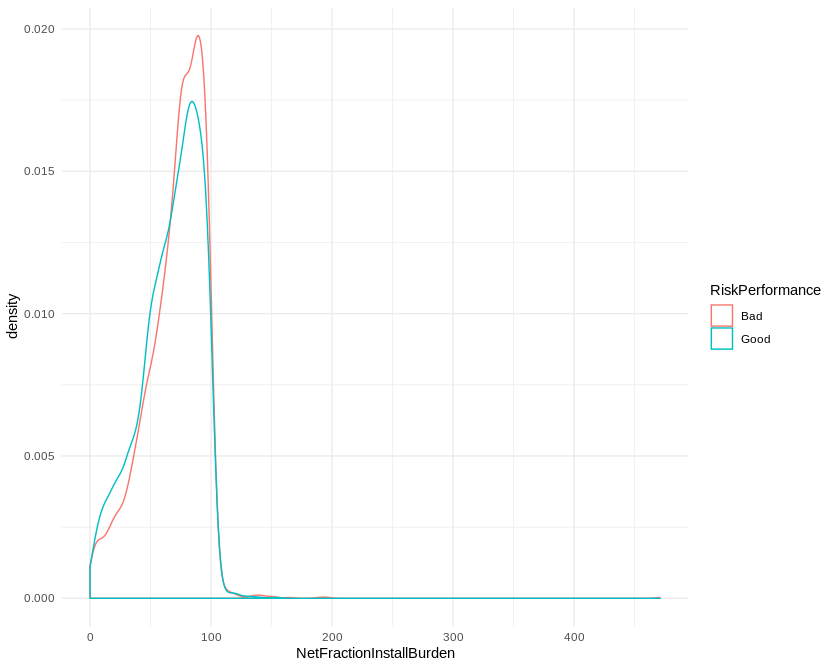

Zbiór wartości: 0, 1, 2, 3…

* -9 : 0

* -8 : 3419

* -7 : 0

Udział kredytów ratalnych w obciążeniu kredytowym.
Bardzo podobne rozkłady.

### Number of Revolving Trades With Balance


Zbiór wartości: 0, 1, 2, 3…

* -9 : 0

* -8 : 156

* -7 : 0

Liczba kredytów rolowanych z "balonem", czyli ostateczną dużą spłatą. 
Oczywiście kredytów rolowanych często się wcale nie spłaca,
ewentualnie np. kiedy bank uzna, że ryzyko jest zbyt duże, by ponownie przedłużać 
kredyt. Jak widać klienci, którzy nie spłacili kredytu na czas, częściej spłacają 
kredyty jedną spłatą. Możliwe, że jest to spowodowane odmówieniem przez bank rolowania. 

### Number of Installment Trades With Balance

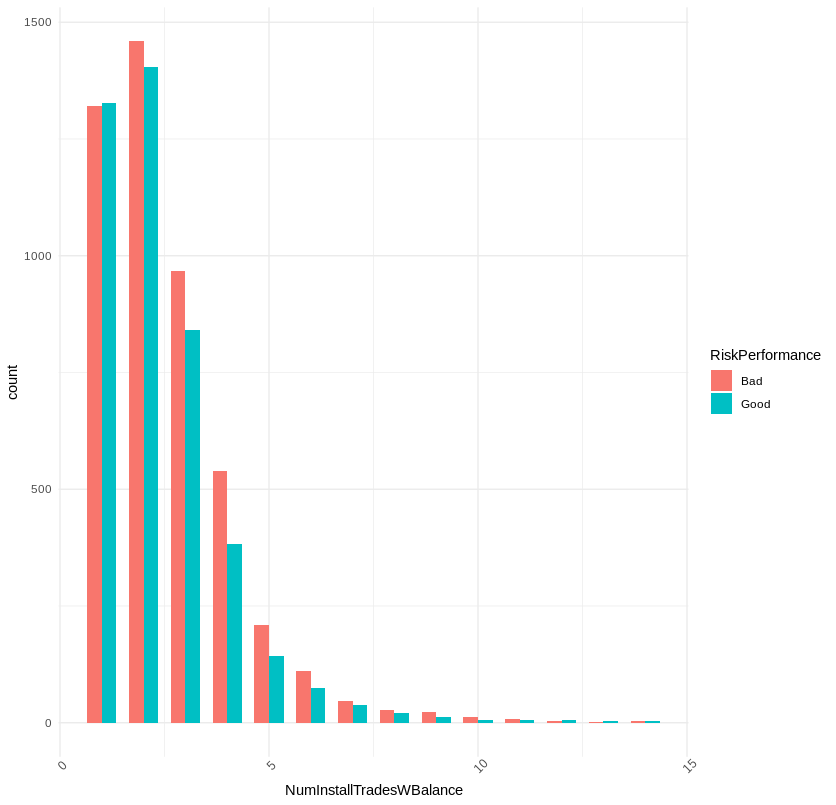

Zbiór wartości: 0, 1, 2, 3…

* -9 : 0

* -8 : 861

* -7 : 0

Liczba kredytów ratalnych ze zbalansowaniem pod koniec, jak wyżej.

### NumBank2NatlTradesWHighUtilization

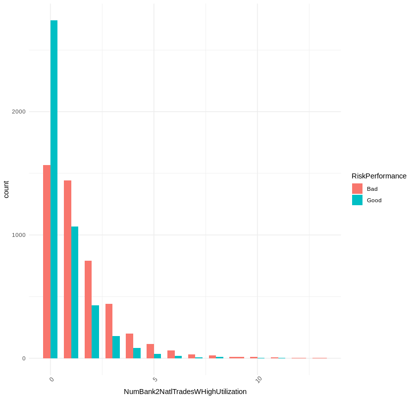

Zbiór wartości: 0, 1, 2, 3…

* -9 : 0

* -8 : 583

* -7 : 0

Liczba kredytów o dużym zysku.

###  Percent of Trades With Balance

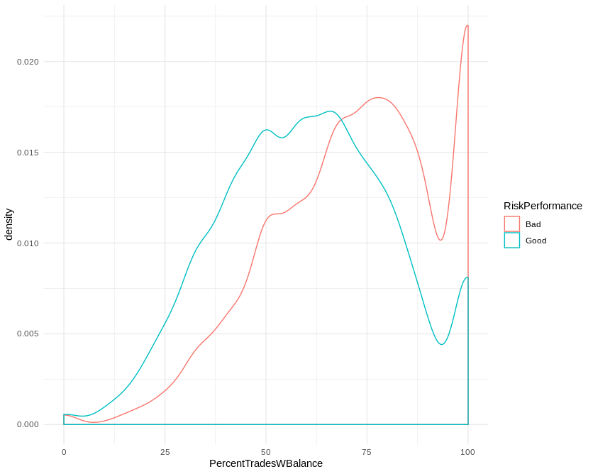

Zbiór wartości: 0-100%

* -9 : 0

* -8 : 18

* -7 : 0

Procent kredytów zbalansowanych, z "balonem".
Duże różnice w rozkładach, potencjalnie bardzo ważna zmienna.
Ponownie rozkłady wskazują, że grupa nie spłacająca częściej spłacała
kredyt w balonie.

# Metody

##Czyszczenie danych 
Jak widzimy w naszym zbiorze było dużo braków danych, ale każdy z tych braków różnił się między sobą znaczeniem więc uzupełnialiśmy braki w zależności od ich rodzaju.

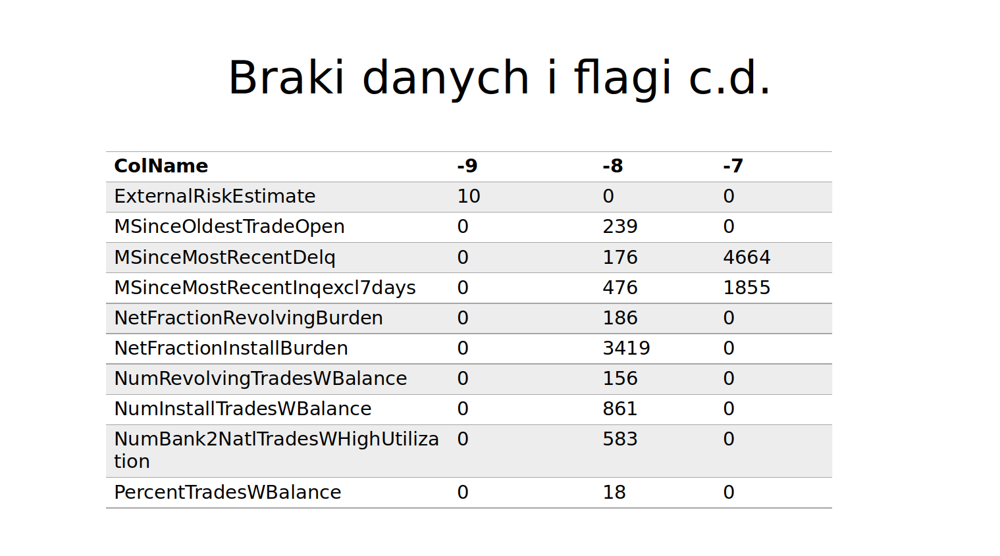

* ***-9*** -
Analzując dostarczony do datasetu słownik, uznaliśmy daną wartość za brak. Te wartości często występowały całymi wierszami, co nie dawało nam żadnych informacji na temat zdolności kredytowej danego klienta. Postanowiliśmy  rekordy zawierające  -9 (ok. 600 wierszy). 
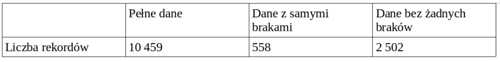

* ***-8*** -
W tym przypadku mieliśmy największy problem z interpretacją znaczenia flagi. $-8$ znajdowało się w różnych kolumnach i różnych wierszach zbioru danych, nie zachowując żadnej regularności. Co więcej liczba rekordów posiadających -8 była zbyt duża, by dane obserwacje usunąć.

Flaga -8 została zastąpiona przy użyciu klasyfikatora knn. Polegało to na tym że dla klienta który miał braki danych znajdowaliśmy ze zbioru klientów o których mieliśmy pełne dane 5-ciu najbardziej podobnych klientów i wartości brakujące zastępowaliśmy średnią bądź medianą z odpowiednich kolumn. 


* ***-7*** -
 Tę wartość interpretowaliśmy na korzyść klienta. Występowała w sytuacjach dotycznacych np. ilości miesięcy od ostatniego zadłużenia. Z opisu w słowniczku wynikało, że dane zdarzenie nie zostało zarejestrowane, co implikowało, że klient nie był nigdy zadłużony. W związku z czym przypisywaliśmy odpowiednie wartości dla poszczególnych cech, tak by korzystnie wpływały na ocenę klienta. 

#Wybór klasyfikatora i ważność cech

Testowaliśmy następujące klasyfikatory:

* svm
* rpart
* Ida
* qda
* rf
* nb

Inżynierie cech w naszym datasecie zaczeliśmy od podziału zbioru danych na "Bad" i "Good" klientów oraz analizę historgamów dla każdej z cech. W niektórych z nich zauważyliśmy znaczące róznice dla tych dwóch zbiorów. Uznaliśmy, że mogą być one podstawą do odpowiedniej klasyfikacji. Wybrane przez nas atrybuty to :

***a)***

* MSinceOldestTradeOpen
* MSinceOldestTradeOpen  
* PercentTradesNeverDelq  
* MSinceMostRecentDelq
* MaxDelq2PublicRecLast12M
* MaxDelqEver
* NetFractionRevolvingBurden
* NetFractionInstallBurden
* NumRevolvingTradesWBalance
* NumBank2NatlTradesWHighUtilization
* PercentTradesWBalance 

Jednak zauważyliśmy, że w atrybutach jakościowych : "MaxDelqEver", "MaxDelq2PublicRecLast12M" , najczęściej występowaną wartością jest ta, która oznacza, że nic nie wiemy o danym zdarzeniu. Tak więc uznaliśmy, że kolejny dataset który przetestujemy będzie wykluczał te dwie cechy z powyżej wypisanego zbioru.

***b)***

* MSinceOldestTradeOpen
* MSinceOldestTradeOpen  
* PercentTradesNeverDelq  
* MSinceMostRecentDelq
* NetFractionRevolvingBurden
* NetFractionInstallBurden
* NumRevolvingTradesWBalance
* NumBank2NatlTradesWHighUtilization
* PercentTradesWBalance 

Dodatkowo sprawdziliśmy jak istotne są poszczególne atrybuty przy klasyfikacji dla danych klasyfikatorów( random forest, svm, rpart, nb, qda, lda). Dla większości z nich wykresy istotności cech wyglądały bardzo podobnie, tak więc na tej podstawie wybraliśmy kolejny dataset:

***c)***

* ExternalRiskEstimate 
* PercentTradesNeverDelq  
* MSinceMostRecentDelq
* AverageMInFile
* NumSatisfactoryTrades
* NetFractionRevolvingBurden
* NumBank2NatlTradesWHighUtilization
* PercentTradesWBalance

Ostatni dataset jaki stworzyliśmy, był w ramach eksperymentu. Chcieliśmy sprawdzić jak klasyfikatory sobie poradzą na zbiorze składających się z zaledwie trzech najbardziej istotnych dla nich atrybutów.

***d)***

* ExternalRiskEstimate 
* PercentTradesNeverDelq  
* MSinceMostRecentDelq

Kolejno zrobiliśmy wykres zależności AUC od ilości cech w zbiorze dla wyżej wymienionych klasyfikatorów, co oznacza, że sprawdzaliśmy ich wyniki na powyżej wymienionych datasetach oraz zbiorze pełnym .

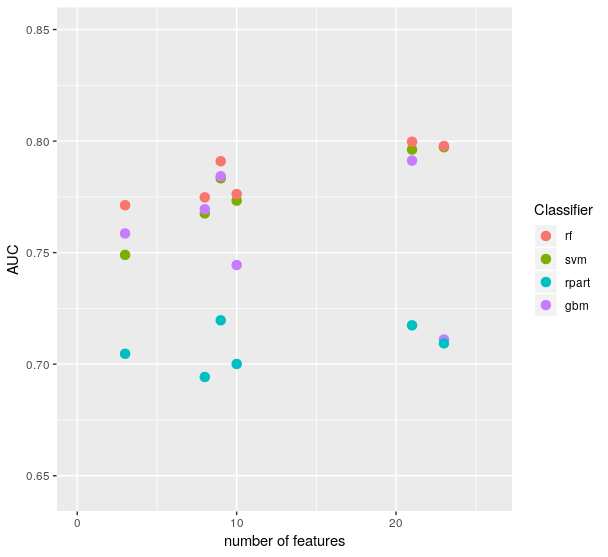

A także wykreślno wykres krzywej ROC 

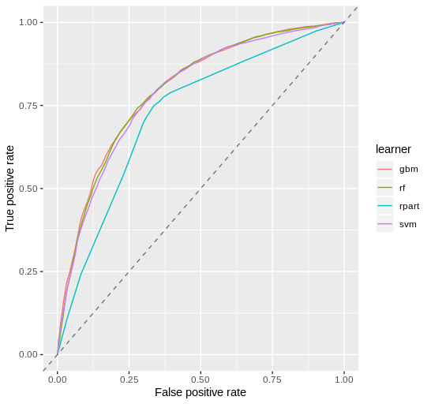


# Rezultaty

Analizując dwa powyższe wykresy, z zależności auc od ilości cech wynika, że prawie w każdym przypadku random forest ma najlepsze wyniki . Na krzywej roc dostrzegamy jedynie różnice klasyfikatora rpart. 

#Tuning hiperparametrów

Postanowiliśmy ztuningować parametry modelu randomForest jako że był najbardziej obiecujący. Użyliśmy następującej techniki zdefiniowaliśmy przestrzeń z której będziemy brali zestawy hiperparametrów jako: ntree od 100 do 1000, mtry od 10 do 50, nodesize od 1 do 50 co 5. Po czym wybraliśmy losowo 200 punktów z tej przestrzeni i wytrenowaliśmy tyleż modeli z danymi parametrami i wybraliśmy najlepszy. Ostateczne parametry to : bogdan wpisz tutaj


# Wnioski 

Początkowo wyniki jakie otrzymywaliśmy tranując klasyfikator random forest na zbiorze pierwotnym, bez żadych modyffikacji to auc=0,77 . Po tuningu otrzymaliśmy wynik auc=0,799 .   Można uznać, że jest to zdecydowanie zadowalający rezultat. 


dac tu tabele o ktorej pisalem w issues


# Bibiografia 