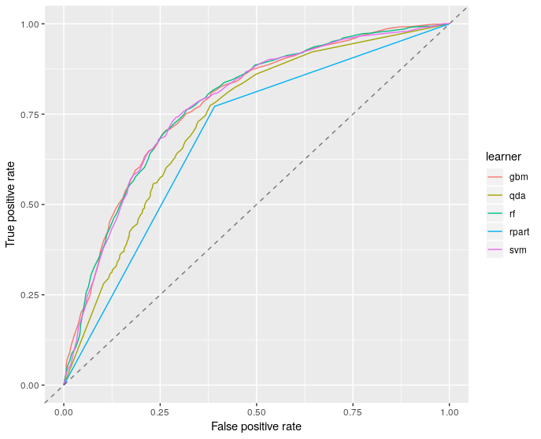

```{r setup, include=FALSE}
knitr::opts_chunk$set(echo = FALSE,warning = FALSE)
library(readr)
library(mlr)
library(ggplot2)
library(DALEX)
library(knitr)
heloc_ok<-read_csv("heloc_ok.csv")
heloc_ok<-heloc_ok[-1]
heloc_ok$MaxDelqEver<-factor(heloc_ok$MaxDelqEver)
heloc_ok$MaxDelq2PublicRecLast12M<-factor(heloc_ok$MaxDelq2PublicRecLast12M)
heloc_ok<-mlr::createDummyFeatures(heloc_ok)
heloc_ok$RiskPerformance<-factor(heloc_ok$RiskPerformance)
heloc_dataset_v1 <- read_csv("heloc_dataset_v1.csv")
heloc_dataset_v1$RiskPerformance<-factor(heloc_dataset_v1$RiskPerformance)
```
## Nasz zbiór - Fico
Naszym problemem była ocena zdolności kredytowej klientów banku. 

```{r, out.width = "500px", out.height= "360px"}
knitr::include_graphics("logo.png")
```

## W ostatniej prezentacji

```{r}

```
Nasz wybór: random forest.

## RandomForest

Pierwsze kroki w losowym lesie...

```{r echo=FALSE }
task<- makeClassifTask(id = "task", data = heloc_dataset_v1, target ="RiskPerformance")
learner_rpart<-makeLearner("classif.randomForest",predict.type = "prob")
cv <- makeResampleDesc("CV", iters = 5)
test_rpart <- resample(learner_rpart, task, cv,measures = auc,show.info = FALSE)
print(test_rpart)
```

## Krzywa ROC
```{r}
roc_r = generateThreshVsPerfData(test_rpart$pred, list(fpr, tpr), aggregate = TRUE)
plotROCCurves(roc_r)
```

## Dataset engineering

W ramach wstępnego czyszczenia danych:
* zamieniliśmy typy odpowiednich zmiennych,
* usunęliśmy puste wiersze.

Braki w bazie danych są nadal duże. 

## EPIC KNN IMPUTATION!

```{r echo=TRUE}
# for(i in 1:nrow(heloc_unclean)) {
#   #print(i)
#   badcols <- which(heloc_unclean_knn[i,] %in% c(-9,-8,-7))
#   k <- FNN::knn(heloc_clean_knn[-badcols], heloc_unclean_knn[i,-badcols], cl=heloc_clean[[1]],
#                 k=5,algorithm="cover_tree")
#   indices <- attr(k, "nn.index")
#   heloc_clean_knn[indices[1,],] %>% summarise_at(names(heloc_clean_knn)[badcols],mean)->imput
#   heloc_unclean_knn[i,badcols]<-imput
# }
```

## Tuning parametrów
Nasze rezultaty:
 
```{r echo=FALSE}
task<-makeClassifTask(id = "task", data = heloc_ok, target ="RiskPerformance")
learner_rf<-makeLearner("classif.randomForest",predict.type = "prob",par.vals =list(ntree=923,mtry=13,nodesize=36))
test_rf <- resample(learner_rf, task, cv,measures = auc,show.info = FALSE)
print(test_rf)
roc_r = generateThreshVsPerfData(test_rf$pred, list(fpr, tpr), aggregate = TRUE)
```
 
## Wyniki

```{r}
plotROCCurves(roc_r)
```

```
ntree=923; mtry=13; nodesize=36
```
## Dziękujemy za uwagę

