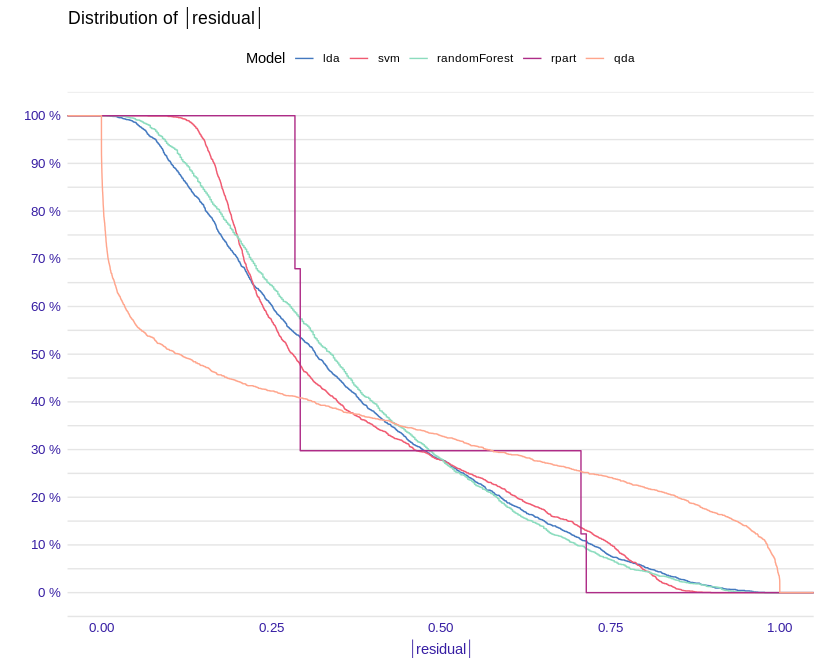
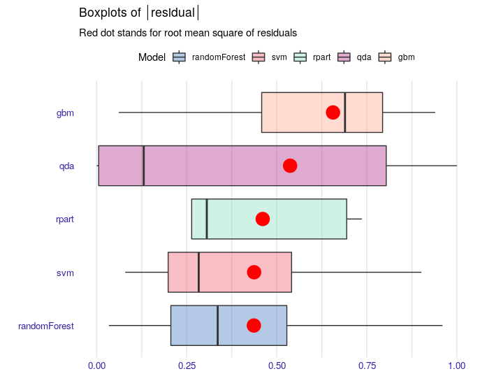
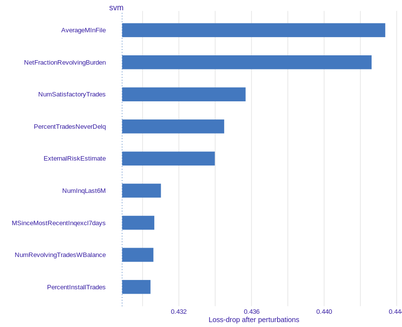
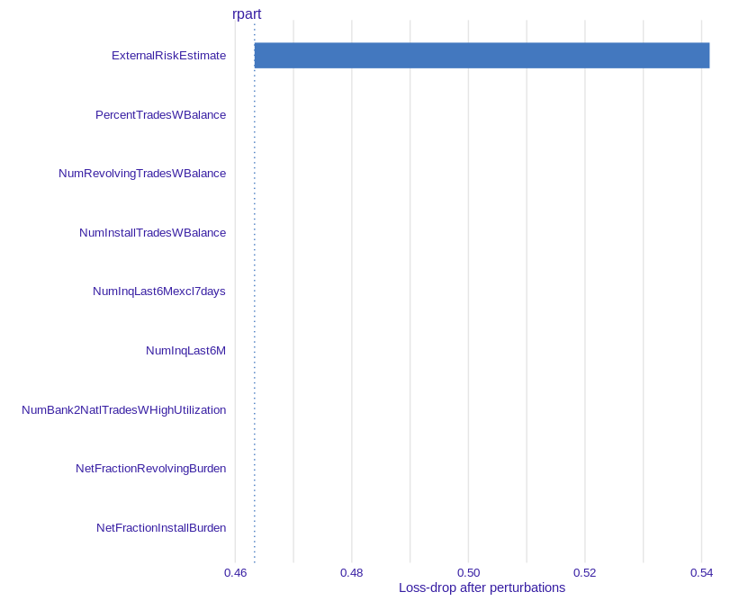
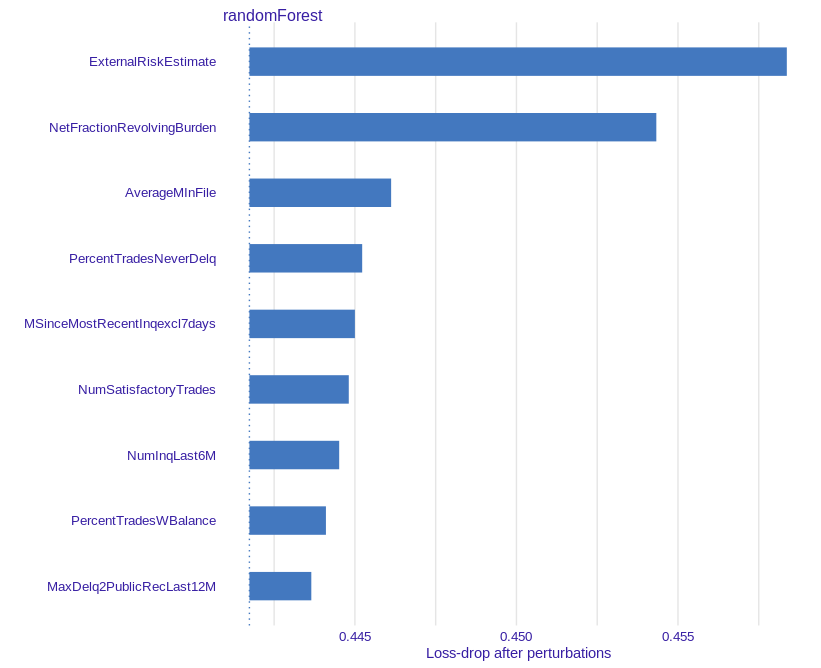
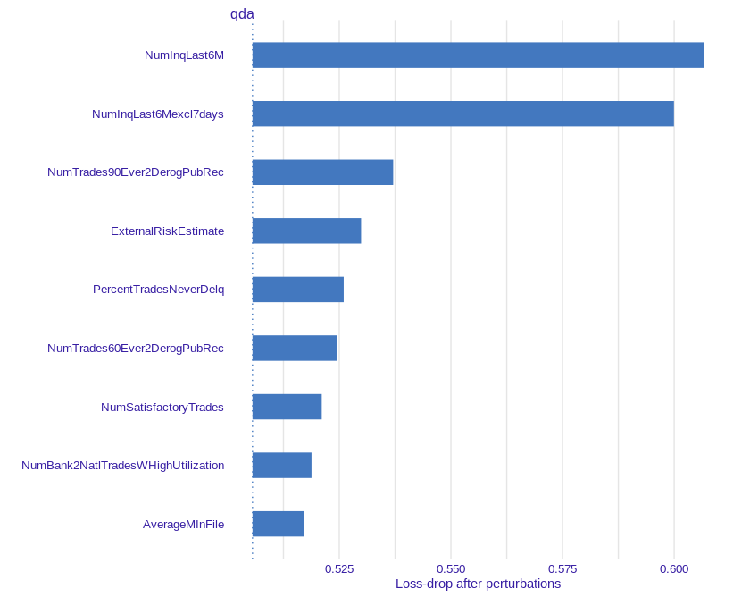
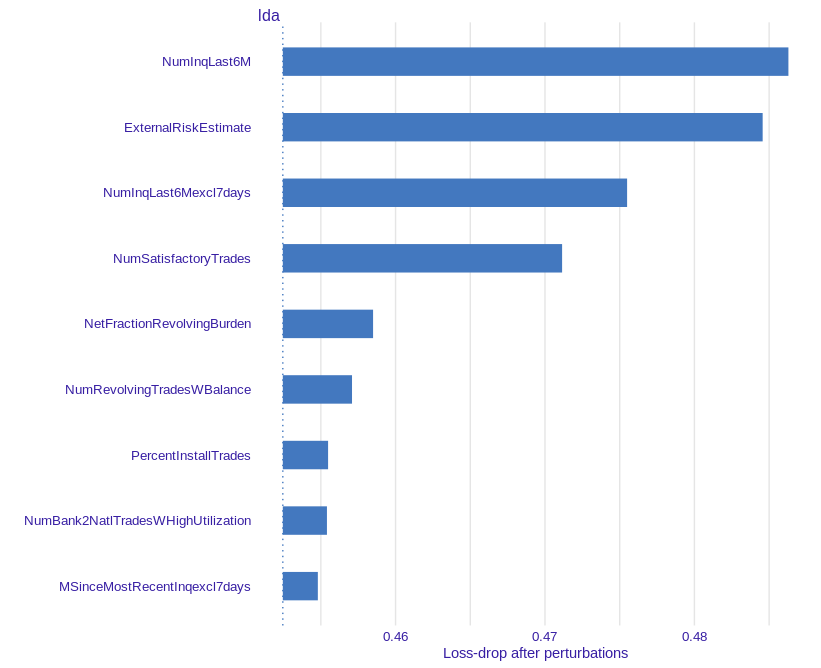
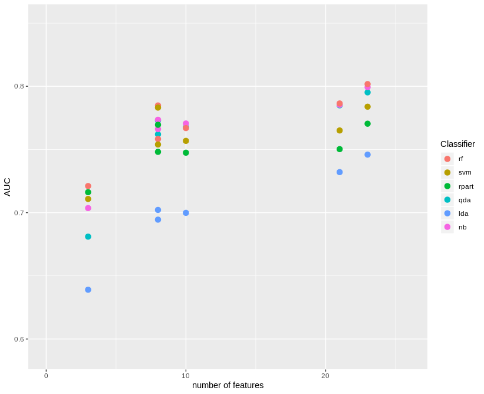

```{r setup, include=FALSE}
# Libraries

knitr::opts_chunk$set(echo = FALSE)
library(readr)
library(mlr)
library(ggplot2)
library(DALEX)
library(kableExtra)
library(knitr)
# Wczytywanie datasetu

# readr::read_csv("final_dataset.csv", col_types = cols(
#   library = col_factor(),
#   model_name = col_factor(),
#   numberOfCategoricalFeatures = col_double(),
#   numberOfNumericalFeatures = col_double(),
#   meanUniqueNumericalValues = col_double(),
#   meanUniqueCategoricalValues = col_double(),
#   meanNumberMissing = col_double(),
#   number_of_instances = col_double(),
#   ACC = col_double()
# )) -> df

# Dataset preparation

# df <- df[!is.na(df$meanUniqueNumericalValues), ] 
# df <- df[!is.na(df$meanUniqueCategoricalValues), ]

```

## Nasz problem

Naszym problemem była ocena zdolności kredytowej klientów banku. Dane pochodzą z FICO 

```{r, out.width = "500px", out.height= "360px"}
knitr::include_graphics("logo.png")
```

## Użyte modele

Użyliśmy następujących modeli:

* svm
* rpart
* Ida
* qda
* rf

## Krzywe dystrybucji rezyduł

```{r out.width = "700px", out.height= "560px"}

```

## Boxploty

```{r}

```


## Ważność zmiennych: svm

```{r}

```

## Ważność zmiennych: rpart

```{r}

```

## Ważność zmiennych: rf

```{r}

```

## Ważność zmiennych: qda

```{r}

```

## Ważność zmiennych: Ida

```{r}

```

## ROC

```{r}
knitr::include_graphics("ROC.png")
```


##AUC

```{r}

```


## Dziękujemy za uwagę!

Olaf Werner
Bogdan Jastrzębski
Joanna Gajewska


