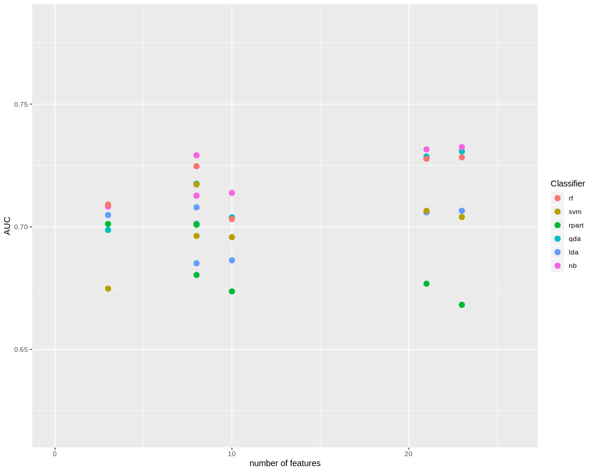

```{r setup, include=FALSE}
knitr::opts_chunk$set(echo = TRUE)
```

## Inżynieria cech
Inżynierie cech w naszym datasecie zaczeliśmy od podziału zbioru danych na "Bad" i "Good" klientów oraz analizę historgamów dla każdej z cech. W niektórych z nich zauważyliśmy znaczące róznice dla tych dwóch zbiorów. Uznaliśmy, że mogą być one podstawą do odpowiedniej klasyfikacji. Wybrane przez nas atrybuty to :

***a)***

* MSinceOldestTradeOpen
* MSinceOldestTradeOpen  
* PercentTradesNeverDelq  
* MSinceMostRecentDelq
* MaxDelq2PublicRecLast12M
* MaxDelqEver
* NetFractionRevolvingBurden
* NetFractionInstallBurden
* NumRevolvingTradesWBalance
* NumBank2NatlTradesWHighUtilization
* PercentTradesWBalance 

Jednak zauważyliśmy, że w atrybutach jakościowych : "MaxDelqEver", "MaxDelq2PublicRecLast12M" , najczęściej występowaną wartością jest ta, która oznacza, że nic nie wiemy o danym zdarzeniu. Tak więc uznaliśmy, że kolejny dataset który przetestujemy będzie wykluczał te dwie cechy z powyżej wypisanego zbioru.

***b)***

* MSinceOldestTradeOpen
* MSinceOldestTradeOpen  
* PercentTradesNeverDelq  
* MSinceMostRecentDelq
* NetFractionRevolvingBurden
* NetFractionInstallBurden
* NumRevolvingTradesWBalance
* NumBank2NatlTradesWHighUtilization
* PercentTradesWBalance 

Dodatkowo sprawdziliśmy jak istotne są poszczególne atrybuty przy klasyfikacji dla danych klasyfikatorów( random forest, svm, rpart, nb, qda, lda). Dla większości z nich wykresy istotności cech wyglądały bardzo podobnie, tak więc na tej podstawie wybraliśmy kolejny dataset:

***c)***

* ExternalRiskEstimate 
* PercentTradesNeverDelq  
* MSinceMostRecentDelq
* AverageMInFile
* NumSatisfactoryTrades
* NetFractionRevolvingBurden
* NumBank2NatlTradesWHighUtilization
* PercentTradesWBalance

Ostatni dataset jaki stworzyliśmy, był w ramach eksperymentu. Chcieliśmy sprawdzić jak klasyfikatory sobie poradzą na zbiorze składających się z zaledwie trzech najbardziej istotnych dla nich atrybutów.

***d)***

* ExternalRiskEstimate 
* PercentTradesNeverDelq  
* MSinceMostRecentDelq

Kolejno zrobiliśmy wykres zależności AUC od ilości cech w zbiorze dla wyżej wymienionych klasyfikatorów, co oznacza, że sprawdzaliśmy ich wyniki na powyżej wymienionych datasetach oraz zbiorze pełnym .



Analizując powyższy wykres, zauważyliśmy, że najlepsze rezultaty osiągamy dla pełnego datasetu,  tak więc postanowiliśmy go nie modyfikować pod kątem usuwania pewnych cech i na nim prowadziliśmy dalsze prace. 
